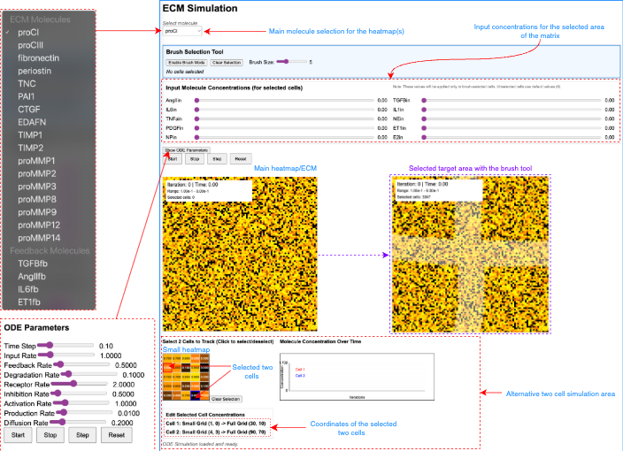
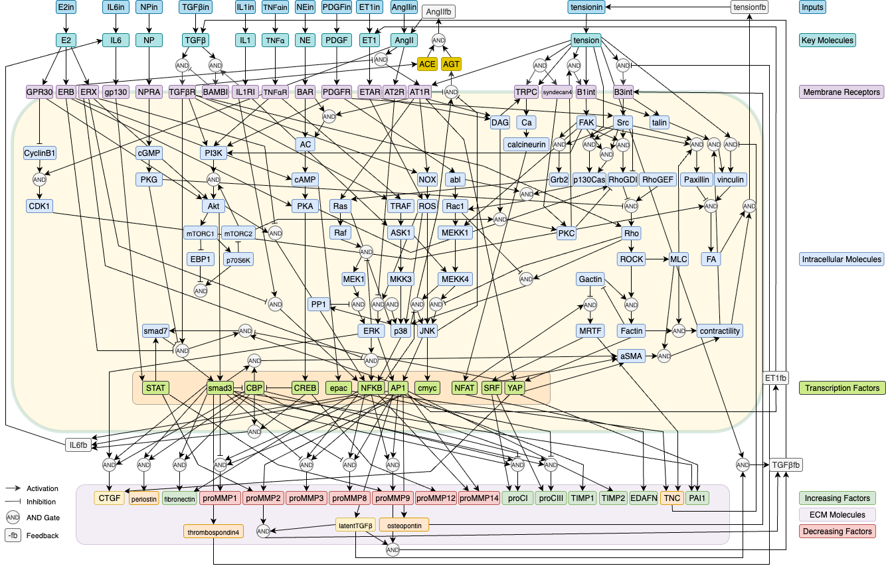

# ECMSim

A real-time interactive web-based simulation of cardiac fibroblast extracellular matrix (ECM) signaling pathways using WebAssembly and ODE-based modeling.



## Overview

This simulation models complex signaling networks in cardiac fibroblasts, including:

- **Real-time ODE solver:** Interactive web-page solves more than 1 million equations simultaneously in real-time.
- **Intracellular signaling cascades:** More than 125 molecules including receptors, kinases, transcription factors).
- **ECM production and regulation:** 17 molecules including collagens, MMPs, TIMPs.
- **Feedback mechanisms:** Between cells (4 key signaling feedback molecules).
- **Spatial diffusion:** Diffusion of molecules across a 100×100 cellular grid.
- **Brush-based cell selection:** for localized input stimulation.
- **Real-time visualization:** with heatmaps and concentration tracking.

## Key Features


### Interactive Brush Tool

- Select specific regions of cells using an adjustable brush
- Apply different input concentrations to selected cells only
- Continuous feeding of input values throughout simulation
- Visual feedback with overlay highlighting

### Real-time ODE Simulation

- Euler integration with adjustable time steps (0.01-0.5)
- Configurable rate constants for all pathway parameters
- Diffusion modeling for ECM and feedback molecules
- Per-cell concentration tracking and modification

### Advanced Visualization

- Main heatmap (500×500px) showing full 100×100 grid
- Select up to 8 cells directly on the main heatmap for detailed tracking
- Real-time line plots of concentration changes over time
- Color-coded gradients (red-yellow for ECM, blue for feedback)
- Figure export in PNG and SVG formats

## Project Structure

```
ecm_simulation/
├── ecm.cpp                # C++ simulation engine with ODE system
├── ecm_visualizer.js      # JavaScript UI and visualization
├── index.html             # Web interface
├── compile.sh             # Emscripten compilation script
├── server.sh              # Local development server
├── ecm.js                 # Generated WebAssembly wrapper (after compilation)
├── ecm.wasm              # Compiled WebAssembly binary (after compilation)
└── README.md             # This file
```

## Prerequisites

### Required Software

- **Emscripten SDK** (emsdk) - for compiling C++ to WebAssembly
- **Python 3** - for local web server
- **Modern web browser** - with WebAssembly support (Chrome, Firefox, Safari, Edge)

### System Requirements

- 4GB+ RAM (for handling 10,000 cell simulation)
- Multi-core CPU recommended for smooth real-time performance

## Installation & Setup

### 1. Install Emscripten SDK

```bash
# Clone and setup emsdk
git clone https://github.com/emscripten-core/emsdk.git
cd emsdk
./emsdk install latest
./emsdk activate latest
source ./emsdk_env.sh
cd ..
```

### 2. Clone and Setup Project

```bash
# Clone this repository
git clone https://github.com/SysMechBioLab/ECMSim
cd ecm_simulation

# Make scripts executable
chmod +x compile.sh server.sh
```

### 3. Compile the Simulation

```bash
# Activate Emscripten environment
source ./emsdk/emsdk_env.sh

# Compile C++ to WebAssembly
./compile.sh
```

Expected output: `ecm.js` and `ecm.wasm` files will be generated.

### 4. Run the Simulation

```bash
# Start local web server
./server.sh
```

Open browser and navigate to: `http://localhost:8000`

## Usage Guide

### Basic Simulation Controls

1. **Molecule Selection**: Choose from dropdown menu

   - ECM molecules (collagen, fibronectin, MMPs, etc.)
   - Feedback molecules (TGFβ, AngII, IL-6, ET-1)
2. **Simulation Controls**:

   - **Start**: Begin continuous simulation
   - **Stop**: Pause the simulation
   - **Step**: Execute single simulation step
   - **Reset**: Clear all data and restart

### Advanced Features

#### Brush Selection Tool

1. Click "Enable Brush Mode"
2. Adjust brush size (1-15 cells radius)
3. Click and drag on main heatmap to select cells
4. Set input concentrations using sliders
5. Selected cells will continuously receive specified inputs

#### Cell Tracking

1. Click directly on the main heatmap to select up to 8 cells for detailed tracking
2. View real-time concentration plots for all selected cells
3. Manually edit individual cell concentrations for any selected cell
4. Monitor spatial and temporal dynamics

#### Figure Export

- Click the export button to save the current heatmap visualization
- Supported formats: PNG and SVG
- Useful for publications and presentations

#### Parameter Tuning

- Click "Show ODE Parameters" to access:
  - Time step control (0.01-0.5)
  - Rate constants for all pathway components
  - Input, feedback, degradation, and diffusion rates

## Quick Start Workflows

The following three minimal worked examples demonstrate common use cases and help new users engage with the platform.

### Workflow 1: Basic Fibrosis Simulation (TGF-β Stimulation)

This workflow demonstrates how localized TGF-β stimulation drives collagen accumulation.

1. Open ECMSim in your browser (`http://localhost:8000`).
2. From the **molecule dropdown**, select **proCI_ecm** (procollagen type I) to visualize collagen in the main heatmap.
3. Click **"Enable Brush Mode"** and adjust the brush size to ~5 cells.
4. Click and drag on the main heatmap to select a rectangular region of cells. The selected region will be highlighted.
5. In the **input concentration panel**, set **TGF-β = 1.0** using the slider. Leave all other inputs at 0.
6. Click **"Start"** to begin the simulation.
7. Observe the main heatmap: over approximately 100-300 iterations, the selected (brushed) region will show increasing yellow color (higher procollagen I concentration), while the surrounding area remains dark.
8. After ~500 iterations, notice how feedback molecule diffusion causes a concentration gradient extending beyond the initially stimulated region, demonstrating paracrine signaling.
9. Click **"Stop"** to pause at any time and inspect the spatial pattern.

**Expected outcome:** Collagen I accumulates in and around the stimulated region, with a diffusion gradient spreading outward.

### Workflow 2: Combinatorial Cytokine Experiment

This workflow compares single vs. multi-factor stimulation and demonstrates cell tracking.

1. Click **"Reset"** to start fresh.
2. Select **proCI_ecm** from the molecule dropdown.
3. Enable Brush Mode with brush size ~8.
4. Draw an **X-shaped** pattern on the heatmap by clicking and dragging.
5. Set **TGF-β = 1.0**, **AngII = 1.0**, **IL6 = 1.0**, and **IL1 = 1.0**. Leave other inputs at 0.
6. Click directly on the **main heatmap** on a cell **inside** the X region to select it as Cell 1 (marked with a colored indicator).
7. Click on a cell **outside** the X region to select it as Cell 2. You can select up to 8 cells for simultaneous tracking.
8. Click **"Start"** and observe:
   - The **main heatmap** shows enhanced collagen accumulation in the X region compared to Workflow 1 (single TGF-β), reflecting synergistic pathway crosstalk.
   - The **real-time line plots** show Cell 1 (stimulated) rapidly increasing in proCI concentration, while Cell 2 (unstimulated) shows a delayed, smaller increase due to diffusing feedback molecules.
9. Try switching the molecule dropdown to **proMMP9_ecm** (MMP-9) to observe the MMP response in the same spatial pattern.

**Expected outcome:** Multi-factor stimulation produces stronger and faster ECM accumulation than TGF-β alone. The line plots reveal distinct temporal dynamics between stimulated and unstimulated cells.

### Workflow 3: Parameter Sensitivity Exploration

This workflow demonstrates how rate constant changes affect fibrotic outcomes in real time.

1. Click **"Reset"** and set up a simple stimulation: enable Brush Mode, select a small square region, and set **TGF-β = 1.0**.
2. Select **proCI_ecm** and click **"Start"**. Let the simulation run for ~200 iterations to establish a baseline pattern, then click **"Stop"**.
3. Click **"Show ODE Parameters"** to open the parameter panel.
4. **Experiment A (degradation rate):** Increase `k_degradation` from 0.1 to 0.3 using the slider. Click **"Start"** again and observe: higher degradation reduces collagen accumulation and narrows the spatial spread.
5. Click **"Stop"**, then **reset** `k_degradation` back to 0.1.
6. **Experiment B (production rate):** Increase `k_production` from 0.01 to 0.03. Click **"Start"** and observe: higher production rate substantially increases collagen levels, consistent with the sensitivity analysis showing `k_production` as the most influential parameter.
7. **Experiment C (feedback sensitivity):** Reset `k_production` to 0.01, then increase `k_feedback` from 0.5 to 1.5. Observe how enhanced feedback amplifies the paracrine signaling, extending the spatial spread of the fibrotic response.
8. Try adjusting the **time step** (dt) slider to see how it affects simulation speed and stability.

**Expected outcome:** `k_production` has the largest effect on ECM accumulation magnitude, `k_degradation` controls the balance between deposition and turnover, and `k_feedback` primarily affects the spatial extent of the fibrotic response.

## Scientific Background


### Modeled Pathways

**Input Signals**: AngII, TGFβ, mechanical tension, cytokines (IL-6, IL-1, TNFα), catecholamines, growth factors (PDGF), endothelin-1, natriuretic peptides, estrogen

**Key Signaling Cascades**:

- MAPK pathways (ERK, p38, JNK)
- PI3K-Akt-mTOR signaling
- Rho/ROCK cytoskeletal regulation
- Calcium and cAMP second messenger systems
- NFκB, AP-1, STAT transcriptional programs

**ECM Regulation**:

- Collagen synthesis (Type I, III)
- Matrix metalloproteinases (MMPs 1,2,3,8,9,12,14)
- Tissue inhibitors (TIMP1, TIMP2)
- Matricellular proteins (fibronectin, periostin, tenascin-C)

### Diffusion Model

- **Feedback molecules**: Diffusion coefficient = 0.2 (dimensionless units)
- **ECM molecules**: Diffusion coefficient = 0.04 (5× slower than feedback)
- **Spatial discretization**: 100×100 cellular grid
- **Boundary conditions**: Periodic (toroidal topology)

## Technical Implementation

### WebAssembly Performance

- **C++ simulation core**: Handles 10,000 cells × 132 molecules in real-time
- **JavaScript visualization**: 60 FPS rendering with Canvas API
- **Memory management**: Efficient pointer-based data access
- **Function exports**: 15+ C++ functions accessible from JavaScript

### Numerical Methods

- **ODE integration**: Forward Euler method
- **Diffusion solver**: Explicit finite difference with periodic boundaries
- **Rate constants**: Biologically-informed parameter ranges
- **Stability**: Adaptive time stepping prevents numerical instabilities

## Troubleshooting

### Common Issues

**"Module not found" error**:

```bash
# Ensure Emscripten is properly activated
source ./emsdk/emsdk_env.sh
./compile.sh
```

**Slow performance**:

- Reduce time step in ODE parameters
- Use Chrome for best WebAssembly performance
- Close other browser tabs to free memory

**Compilation errors**:

```bash
# Check Emscripten version
emcc --version

# Clean and recompile
rm ecm.js ecm.wasm
./compile.sh
```

**Visualization not updating**:

- Check browser console (F12) for JavaScript errors
- Verify all files are served from same domain (use local server)

## Development

### Extending the Model

**Adding new molecules**:

1. Add to appropriate struct in `ecm.cpp`
2. Update initialization functions
3. Add rate equations in `calculateRates()`
4. Update JavaScript molecule mappings

**Modifying UI**:

- Edit `ecm_visualizer.js` for interface changes
- Update `index.html` for layout modifications
- Recompile only needed for C++ changes

### Performance Optimization

**C++ optimizations**:

- Compiler flags: `-O2` (already enabled)
- Memory layout: Structure of arrays for better cache locality
- SIMD instructions: Potential future enhancement

**JavaScript optimizations**:

- Canvas rendering: Off-screen buffer for complex visualizations
- Data structures: Typed arrays for numerical data
- Animation: RequestAnimationFrame for smooth updates

## Contributing

1. Fork the repository
2. Create feature branch (`git checkout -b feature/new-pathway`)
3. Add tests for new functionality
4. Commit changes (`git commit -am 'Add new signaling pathway'`)
5. Push to branch (`git push origin feature/new-pathway`)
6. Create Pull Request

### Code Style

- **C++**: Google Style Guide with 2-space indentation
- **JavaScript**: ESLint standard configuration
- **Comments**: Biological rationale for all rate equations

## Citation

If you use this simulation in research, please cite:

```
Preprint:
[arXiv:2510.12577](https://doi.org/10.48550/arXiv.2510.12577)

```

## License

MIT License

## Acknowledgments

- This work was supported by the National Institutes of Health (NIGMS R01GM157589) and the Department of Defense (DEPSCoR FA9550-22-1-0379)
- Emscripten team for WebAssembly toolchain
- Scientific literature on cardiac fibroblast signaling
- Open source contributors to mathematical and visualization libraries

---

**Note**: This simulation is for research and educational purposes. Results should be validated against experimental data before drawing biological conclusions.
